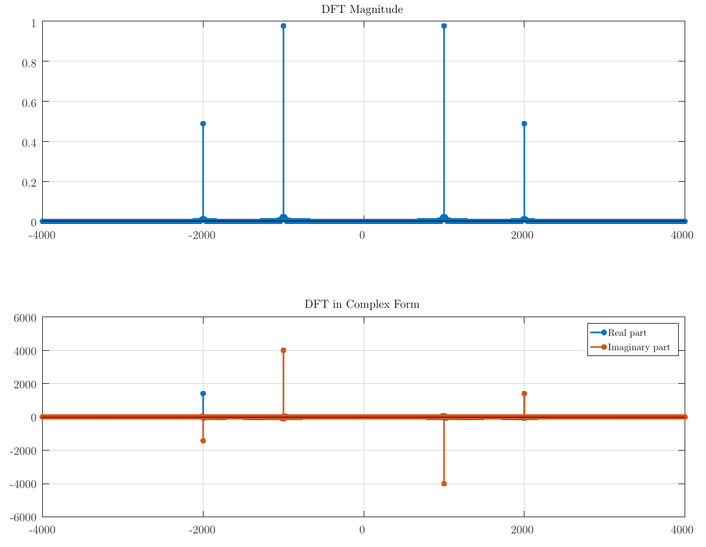

# Atividade: Implementação da DFT usando a matriz

É uma atividade que consiste na implementação da Transformada 
Discreta de Fourier usando o cálculo direto na forma matricial.

## Dependências

Na sua distribuição linux, certifique-se de já ter instalado os pacotes:

- gcc
- make
- octave
- pdflatex

## Instruções de Build e Execução

1. Clone o repositório na sua máquina

```
$ git clone https://github.com/icaro-meneses/dft-matrix
$ cd dft-matrix
```

2. Para realizar a compilação do programa

```
$ make release
```

3. Para executar somente o programa:

```
$ ./dft_matrix.x
```

ou

```
$ make run
```

4. Para executar o programa e exportar o arquivo em .pdf:

```
$ make run graph
```

5. Caso precise fazer a limpeza dos arquivos, execute: `make clean`

6. **Extra:** Para realizar a compilação no modo de DEBUG:

```
$ make debug
```

## Exemplo de resultado

com um sinal x(t) descrito por:

$$x(t) = \sin(2 \pi 1000 t) + 0.5 \cdot \sin(2 \pi 2000 t + \frac{3 \pi}{4})$$

o resultado da operação de DFT é



**Nota:** O código ainda requer testes.

